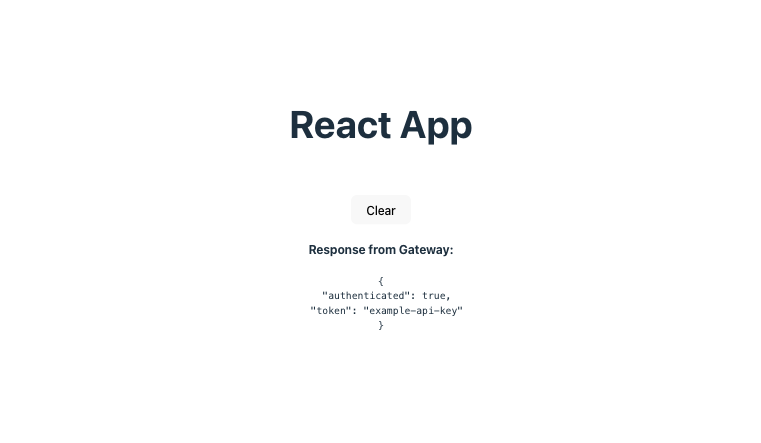

APIs are essential in modern web development as they enable developers to integrate external data into their applications. However, when using APIs, developers must be cautious when handling API keys. These keys authenticate requests to an API, and if they fall into the wrong hands, they can be used to make unauthorized requests and potentially incur costs or expose sensitive data.

<!--truncate-->

While some API keys, like those for Google Maps, can be safely used in client-side applications due to restrictions that limit their use to specific apps, many should never be exposed to the client and should be handled securely on the server side.

For applications without a dedicated server component, developers can use a proxy server or an API Gateway to securely make API calls while hiding API keys from the client. An API Gateway serves as a middleman between the client and the external API, allowing developers to handle the API key on the server side and proxy requests to the API.

In this article, we explore how to protect API keys in React projects using [Gateweaver](https://github.com/gateweaver/gateweaver), an open-source API Gateway designed to help developers securely manage API keys and sensitive data.

The complete source code for this guide is available on [GitHub](https://github.com/gateweaver/gateweaver/tree/main/examples/react-app).

## Set up the React App

### Create a new React app using Vite

First, let's create a new react app using vite. We'll be using vite's typescript template for this tutorial. We will also be using pnpm as the package manager, but you can use npm or yarn if you prefer.

```bash
pnpm create vite@latest react-app --template react-ts
```

### Start the React development server

Next, navigate to the newly created `react-app` folder and start the development server.

```bash
cd react-app
pnpm install
pnpm dev
```

You should now see the react app running on [http://localhost:5173](http://localhost:5173).

## Set up Gateweaver

### Install Gateweaver CLI

Next, let's install the Gateweaver CLI tool, which we will use to configure and run the API Gateway.

```bash
pnpm add -D @gateweaver/cli
```

We install the CLI tool as a dev dependency as we only need it during development. For production, you will most likely want to use the [Gateweaver Docker image](https://hub.docker.com/r/gateweaver/server). You can find out more about deploying Gateweaver to production in the [Deployment Documentation](https://gateweaver.io/docs/deployment).

### Configure Gateweaver

Next, let's create a `gateway` folder in our project where we will store our Gateweaver configuration files.

```bash
mkdir gateway
```

Inside the `gateway` folder, create a new file called `gateweaver.yml`. This file will contain the configuration for our API Gateway.

```yaml title="gateweaver.yml"
policyDefinitions:
  cors:
    origin: "${CLIENT_URL}"

endpoints:
  - path: "/example"
    target:
      url: "https://httpbin.org/bearer"
    request:
      headers:
        Authorization: "Bearer ${API_KEY}"
    policies:
      - cors
```

In this configuration file, we define an endpoint `/example` that proxies requests to [https://httpbin.org/bearer](https://httpbin.org/bearer). Httpbin is a simple HTTP request and response service that can be used for API testing. We use the [httpbin `/bearer` endpoint](https://httpbin.org/#/Auth/get_bearer), which requires an `Authorization` header with a `Bearer` token. We use the `${API_KEY}` syntax to reference an environment variable that will contain our API key to authenticate requests to the httpbin API. We also define a CORS policy that allows requests from `${CLIENT_URL}`.

### Add server environment variables

To define the environment variables referenced in the configuration file, we can create a `.env.gateweaver` file in the `gateway` folder. Make sure to add this file to your `.gitignore` file to avoid committing sensitive data to your repository.

```bash title=".env.gateweaver"
API_KEY=example-api-key
CLIENT_URL=http://localhost:5173
```

In this file, we define the `API_KEY` environment variable with our example API key and the `CLIENT_URL` environment variable with the URL of our react app.

### Start the Gateweaver development server

Before we start the Gateweaver development server, let's add a script to the `package.json` file to make it easier to run the server.

```json title="package.json"
{
  "scripts": {
    "gateway": "cd gateway && gateweaver start -w"
  }
}
```

This script changes the directory to the `gateway` folder and runs the `gateweaver start -w` command, which starts the Gateweaver development server in watch mode on port 8080.

Now, let's start the Gateweaver development server by running the following command:

```bash
pnpm run gateway
```

You should be able to test the `/example` endpoint by making a request to [http://localhost:8080/example](http://localhost:8080/example). The request will be proxied to [https://httpbin.org/bearer](https://httpbin.org/bearer) with the `Authorization` header set to the API key defined in the `.env.gateweaver` file. The response should be the following JSON:

```json
{
  "authenticated": true,
  "token": "example-api-key"
}
```

## Update the React app to use the API Gateway

Now that we have set up Gateweaver, let's update our React app to use the API Gateway to make requests to [https://httpbin.org/bearer](https://httpbin.org/bearer) without exposing the API key to the client.

### Add client environment variables

First, let's add the gateway URL as an environment variable in our react project. To do this in a Vite project, we can create a `.env.local` file in the root of our project and add the following line:

```bash title=".env.local"
VITE_GATEWAY_URL=http://localhost:8080
```

Make sure to also add this file to your `.gitignore` file.

### Update the React app

Next, let's update the `App.tsx` file to make requests to the API Gateway. We will add a button that fetches data from the Gateway's `/example` endpoint and display the response on the page.

```tsx title="src/App.tsx"
import { useState } from "react";
import "./App.css";

interface GatewayResponse {
  authenticated: boolean;
  token: string;
}

function App() {
  const [gatewayResponse, setGatewayResponse] =
    useState<GatewayResponse | null>(null);

  const handleClick = async () => {
    if (gatewayResponse) {
      setGatewayResponse(null);
      return;
    }

    try {
      const BASE_URL = import.meta.env.VITE_GATEWAY_URL;

      const response = await fetch(`${BASE_URL}/example`);

      if (!response.ok) {
        console.error("Failed to fetch data");
        return;
      }

      const data = await response.json();

      setGatewayResponse(data);
    } catch (error) {
      console.error(error);
    }
  };

  const buttonText = gatewayResponse ? "Clear" : "Fetch data";

  return (
    <>
      <h1>React App</h1>
      <div className="card">
        <button onClick={handleClick}>{buttonText}</button>

        {gatewayResponse && (
          <>
            <h4>Response from Gateway:</h4>
            <pre>{JSON.stringify(gatewayResponse, null, 2)}</pre>
          </>
        )}
      </div>
    </>
  );
}

export default App;
```

Now, when you click the button in your React app, it will make a request to the `/example` endpoint on the API Gateway. This will proxy the request to [https://httpbin.org/bearer](https://httpbin.org/bearer) using the API key defined in the `.env.gateweaver` file. Then the response from the httpbin API will be displayed on the page:



## Conclusion

In this tutorial, we learned how to protect API keys in React projects using Gateweaver. We set up a simple API Gateway and configured it to proxy requests to an external API. We then used the Gateway to make requests from our React app to the external API without exposing the API key to the client.

Gateweaver provides additional policies such as rate limiting and jwt validation that you can use to further secure your application. You can find out more about Gateweaver and its features in the [documentation](https://gateweaver.io/docs/getting-started). There you can also find information on how to deploy Gateweaver to production.

If you have found this tutorial helpful, please consider giving the [Gateweaver repo](https://github.com/gateweaver/gateweaver) a star!
