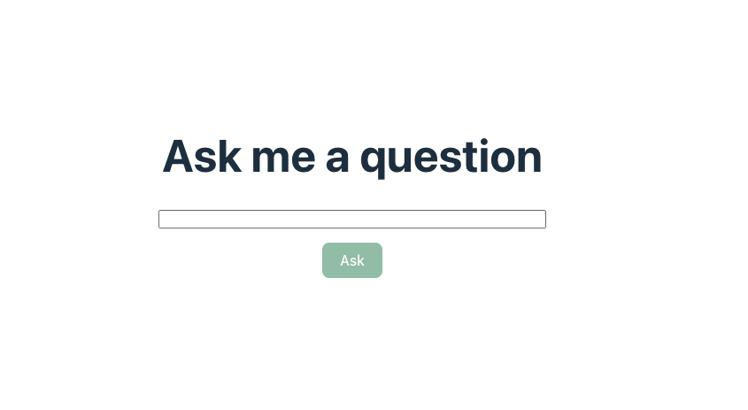

OpenAI's API is a powerful tool for building AI-powered applications. However, using the API directly in a client-side application, like a React app, can expose your API key to potential attackers. To ensure the security of your API key, it is recommended to route requests through a backend server, as outlined in [OpenAI's Best Practices for API Key Safety](https://help.openai.com/en/articles/5112595-best-practices-for-api-key-safety).

<!--truncate-->

If you don't have a backend server or prefer not to set one up just to handle requests to the OpenAI API, you can use [Gateweaver](https://github.com/gateweaver/gateweaver). This API Proxy allows you to route requests through a secure server without writing any backend code.

In this tutorial, we'll show you how to use OpenAI's API in a React app without exposing your API key by using Gateweaver to proxy requests to the API. We will build a simple React app where users can ask questions and receive answers, utilizing the OpenAI Node.js library client-side while securely routing API requests through Gateweaver to protect your API key.

The complete source code for this tutorial is available on [GitHub](https://github.com/gateweaver/gateweaver/tree/main/examples/openai-react).

## Prerequisites

Before you begin, make sure you have the following:

- An OpenAI API key. You can get one by signing up for an account on the [OpenAI website](https://platform.openai.com/signup).
- You have [purchased credits](https://help.openai.com/en/articles/8264644-what-is-prepaid-billing) on OpenAI to use the API.
- Node.js installed on your machine.
- Basic knowledge of React and JavaScript.

## Set up the React App

### Create a new React app

First, let's create a new react app using vite. We'll be using vite's typescript template for this tutorial.

```bash
npm create vite@latest openai-react -- --template react-ts
```

### Start the React development server

Next, navigate to the newly created `openai-react` folder and start the development server:

```bash
cd openai-react
npm install
npm run dev
```

You should now see the react app running on [http://localhost:5173](http://localhost:5173).

## Set up Gateweaver

### Install Gateweaver CLI

Next, let's install the Gateweaver CLI tool, which we will use to configure and run the API Proxy.

```bash
npm install -D @gateweaver/cli
```

We install the CLI tool as a dev dependency as we only need it during development. For production, you will most likely want to use the [Gateweaver Docker image](https://hub.docker.com/r/gateweaver/server). You can find out more about deploying Gateweaver to production in the [Deployment Documentation](https://gateweaver.io/docs/deployment).

### Configure Gateweaver

Next, let's create a folder called `proxy` in our project where we will store our Gateweaver configuration files.

```bash
mkdir proxy
```

Inside the `proxy` folder, create a new file called `gateweaver.yml`. This file will contain the configuration for our API Proxy.

```yaml title="gateweaver.yml"
policyDefinitions:
  cors:
    origin: "${CLIENT_URL}"

endpoints:
  - path: "/openai"
    target:
      url: "https://api.openai.com/v1"
    request:
      headers:
        Content-Type: "application/json"
        Authorization: "Bearer ${OPENAI_API_KEY}"
    policies:
      - cors
```

In the `gateweaver.yml` file, we define a single endpoint called `/openai` that proxies requests to the OpenAI API. We set the `Authorization` header to include our OpenAI API key, which is stored in an environment variable called `OPEN_AI_API_KEY`, which we will define in the next step. We also include a CORS policy to allow requests from our React app.

### Set up server environment variables

To define the environment variables referenced in the `gateweaver.yml` file, create a `.env.gateweaver` file in the `proxy` folder. Make sure to add this file to your `.gitignore` file to avoid committing sensitive data to your repository.

```bash
OPENAI_API_KEY=YOUR_OPENAI_API_KEY
CLIENT_URL=http://localhost:5173
```

In this file replace `YOUR_OPENAI_API_KEY` with your actual OpenAI API key, and set the `CLIENT_URL` to `http://localhost:5173` to match the URL of your React app running locally.

### Start the Gateweaver server

Before we start the Gateweaver development server, let's add a script to the `package.json` file to make it easier to run the server.

```json title="package.json"
{
  "scripts": {
    "proxy": "cd proxy && gateweaver start -w"
  }
}
```

This script changes the directory to the `proxy` folder and runs the `gateweaver start -w` command, which starts the Gateweaver development server in watch mode on port 8080.

Now, let's start the Gateweaver development server by running the following command in a separate terminal window from the one running the React app:

```bash
npm run proxy
```

The Gateweaver server should now be running on [http://localhost:8080](http://localhost:8080), and be ready to proxy requests to the OpenAI API.

## Use OpenAI API in React

Now that we have Gateweaver set up to proxy requests to the OpenAI API, let's update our React app to use the API through the proxy.

### Set up client environment variables

First, let's add the API Proxy URL to our React app as an environment variable so we can use it later in our code. To do this in a Vite project, create a `.env.local` file in the root of your project and add the following line:

```bash title=".env.local"
VITE_PROXY_URL=http://localhost:8080
```

### Install the OpenAI Node.js client library

Next, let's install the OpenAI Node.js client library in our React app to interact with the OpenAI API.

```bash
npm install openai
```

### Update the React app

Now, let's update the `App.tsx` file to make requests to the API Proxy. We will add a simple form where users can input a question, and when they submit the form, we will send the question to the OpenAI API through the API Proxy and display the response on the page.

Here's the updated `App.tsx` file:

```tsx title="src/App.tsx"
import { useState } from "react";
import OpenAI from "openai";
import "./App.css";

const PROXY_URL = import.meta.env.VITE_PROXY_URL;

const openai = new OpenAI({
  baseURL: `${PROXY_URL}/openai`,
  apiKey: "",
  dangerouslyAllowBrowser: true,
});

const generateMessage = async (userInput: string): Promise<string | null> => {
  const completion = await openai.chat.completions.create({
    model: "gpt-3.5-turbo",
    messages: [
      {
        role: "system",
        content:
          "You are a helpful assistant that is here to answer questions.",
      },
      {
        role: "user",
        content: userInput,
      },
    ],
  });

  return completion.choices[0].message.content;
};

const App = () => {
  const [userInput, setUserInput] = useState("");
  const [message, setMessage] = useState("");
  const [error, setError] = useState("");
  const [loading, setLoading] = useState(false);

  const handleSubmit = async (e: React.FormEvent) => {
    e.preventDefault();
    setLoading(true);
    setError("");

    try {
      const response = await generateMessage(userInput);
      if (!response) {
        throw new Error("Failed to generate message.");
      }

      setMessage(response);
      setUserInput("");
    } catch (error) {
      console.error(error);
      setError("Something went wrong. Please try again.");
    }

    setLoading(false);
  };

  return (
    <div>
      <h1>Ask me a question</h1>
      <div className="content">
        {message ? (
          <>
            <p>{message}</p>
            <button className="reset-button" onClick={() => setMessage("")}>
              Ask another question
            </button>
          </>
        ) : (
          <form className="question-form" onSubmit={handleSubmit}>
            <input
              className="input"
              value={userInput}
              onChange={(e) => setUserInput(e.target.value)}
            />
            <button className="submit-button" disabled={!userInput || loading}>
              {loading ? "Loading..." : "Ask"}
            </button>
            {error && <p className="error-message">{error}</p>}
          </form>
        )}
      </div>
    </div>
  );
};

export default App;
```

In this updated `App.tsx` file, we define a function called `generateMessage` that sends a user's input to the OpenAI API through the API Proxy and returns the response. We then use this function in the `handleSubmit` function to generate a response to the user's question and display it on the page.

Note that we set the `baseURL` property of the `OpenAI` client to the URL of the API Proxy. We also set the `apiKey` property to an empty string, as we are not using the API key in the front end. Instead, we are sending requests through the API Proxy, which includes the API key in the request headers. We also set `dangerouslyAllowBrowser` to `true` to allow the client to be used in the browser, but this is okay since we are using the API Proxy to secure the API key.

Next, let's update the `App.css` file to add some basic styling to our React app:

```css title="src/App.css"
#root {
  max-width: 1280px;
  margin: 0 auto;
  padding: 2rem;
  text-align: center;
}

.content {
  display: flex;
  flex-direction: column;
  align-items: center;
}

.question-form {
  display: flex;
  flex-direction: column;
  align-items: center;
  max-width: 500px;
  width: 100%;
}

.input {
  width: 100%;
}

.submit-button {
  margin-top: 1rem;
  background-color: #2e8555;
  color: white;
  opacity: 0.5;
  pointer-events: none;
}

.submit-button:enabled {
  opacity: 1;
  pointer-events: auto;
}

.reset-button {
  background-color: #2e8555;
  color: white;
}

.error-message {
  color: red;
}
```

Here is what the React app should look like now:



## Further Improvements

Even though the API key is no longer exposed, attackers could still abuse the API by sending a large number of requests through the proxy server. To mitigate this risk, you can add rate limiting to the proxy server to prevent abuse. To configure rate limiting in Gateweaver, refer to the [Rate Limiting Documentation](https://gateweaver.io/docs/configuration/policies/rate-limit).

Another way to further secure your application is by adding JWT validation to the proxy server, ensuring that only authenticated users can access the API. To configure this, refer to the [JWT Documentation](https://gateweaver.io/docs/configuration/policies/jwt). You can also explore some [example configurations](https://github.com/gateweaver/gateweaver/tree/main/examples) of popular providers like Auth0, Firebase, and Supabase for guidance.

## Conclusion

In this tutorial, we learned how to use OpenAI's API in a React app without exposing the API key by using Gateweaver to proxy requests to the API. We set up a simple API Proxy and configured it to forward requests to the OpenAI API, with the API key included in the request headers. We then built a React app that allows users to ask questions and receive answers from the OpenAI API securely through the API Proxy.

To find out how to deploy Gateweaver to production and learn more about its features, check out the [Gateweaver Documentation](https://gateweaver.io/docs/getting-started). If you found this tutorial helpful, please consider giving the [Gateweaver repo a star](https://github.com/gateweaver/gateweaver)!
